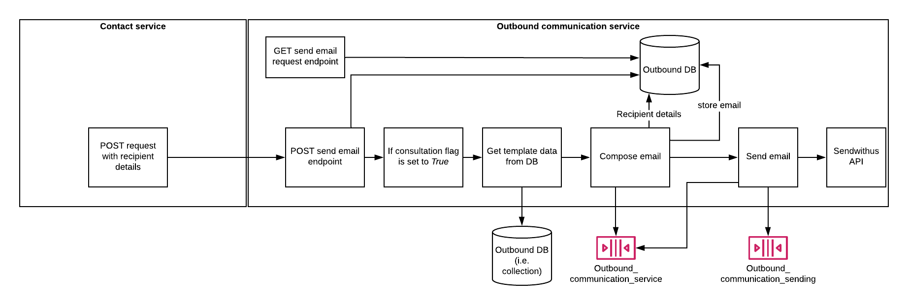

# OutboundCommunication
This service caters for sending outbound communications to customers.



## Steps to setup the service

**1. Install dependencies**

```bash
go get
```

**2. Run the service**


```bash
cd recieve
go buid && ./recieve
```

```bash
cd OutboundCommunication
go buid && ./OutboundCommunication
```

**3. Run the service using make**

```bash
make run-all
```

## Run the Outbound communications API
**You can browse the api at:** <http://localhost:3002>

Here are the following **API endpoints:**

1.	Create a new communication: **POST** http://localhost:3002/communications
2.	Retrieve all communications: **GET** http://localhost:3002/communications
3.	Retrieve a single communication with contactId: **GET** http://localhost:3002/communications/{contactId}
4. Update a communication with contactId: **PUT** http://localhost:3002/communications/{contactId}
5. Delete a communication with contactId: **DELETE** http://localhost:3002/communications/{contactId}